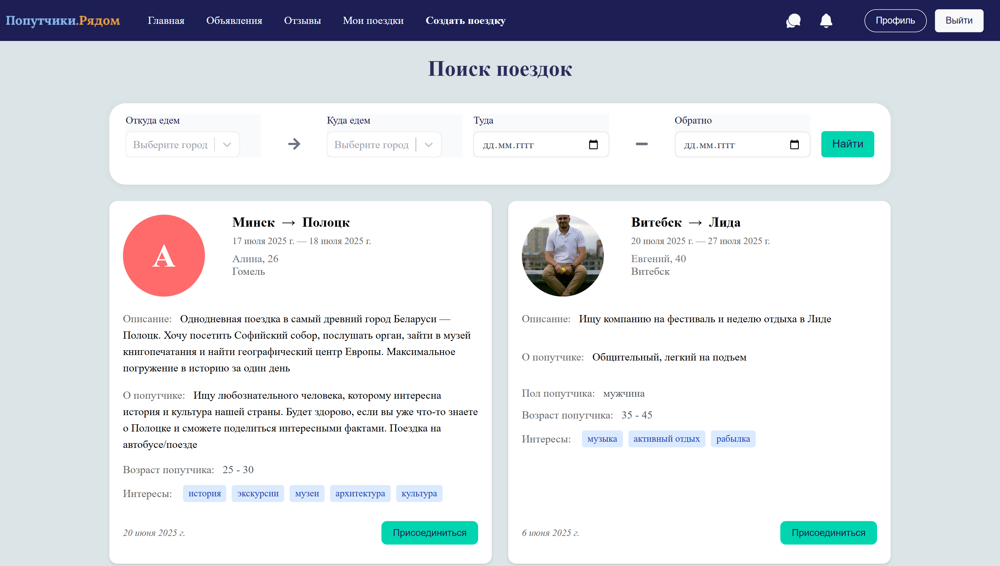
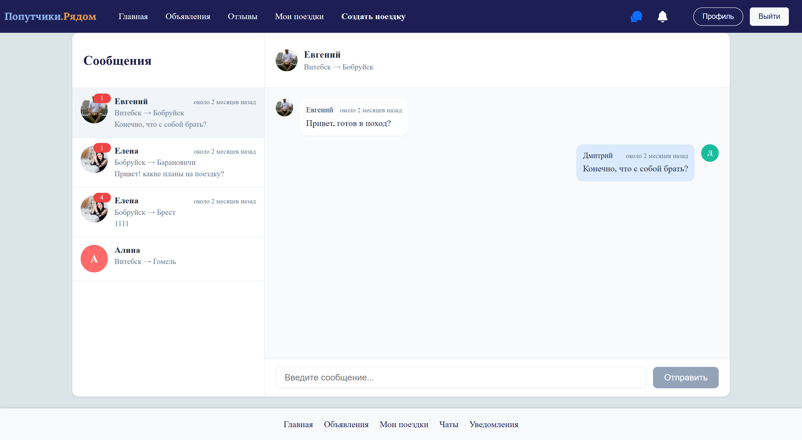
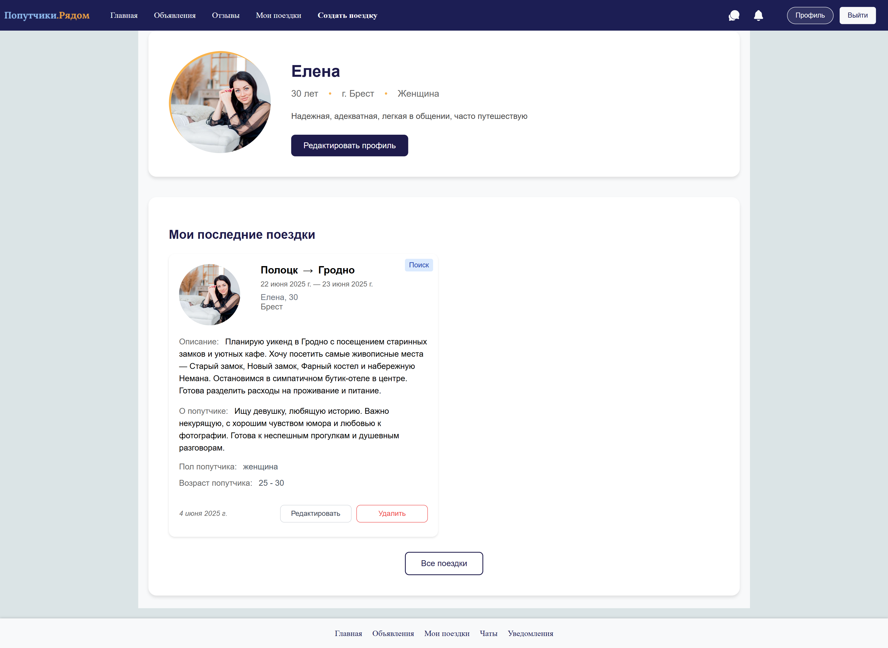

# Web application for finding travel companions

Platform for finding travel partners in Belarus. Connects people for shared trips and experiences.

## Tech Stack

**Client:** 

**Server:** 

**Authentication:** 

**Chat:** 

## Features

**User System**

+ JWT authentication
+ Editable profiles with avatars

**Search for a travel companion**

+ Create/search trip posts

**Matching System**

+ Request to join trips
+ Owners approve/deny requests
+ Approved matches unlock chat

**Real-Time Chat**

**Trip Management**

View trips in three categories:
+ Active (seeking companions)
+ Upcoming (approved)
+ Completed (archived)

**Reviews**

+ Rate completed trips and write a rewiews
+ Search reviews

## Screenshots
Home page

Search page

Chat page

Profile page

User trips page

Rewiews page

